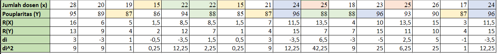

**Hipotesis :**

$H_0$ : $\rho=0$

$H_1$ : $\rho\ne0$

**Statistik Uji :**

$$
\sum{T_x}  = \frac{\sum{t^{3}_x} - tx}{12} = \frac{2^3-2}{12} + \frac{2^3-2}{12} + \frac{2^3-2}{12} + \frac{2^3-2}{12} = \frac{24}{12} = 2
$$ $$
\sum{T_y}  = \frac{\sum{t^{3}_x} - tx}{12} = \frac{3^3-3}{12} + \frac{3^3-3}{12} + \frac{3^3-3}{12} = \frac{72}{12} = 6
$$ $$
\sum{x^2} = \frac{n^3-n}{12} - \sum{T_x} = \frac{16^3-16}{12} - 2 = \frac{4080}{12} - 2 =338
$$ $$
\sum{y^2} = \frac{n^3-n}{12} - \sum{T_y} = \frac{16^3-16}{12} - 6 = \frac{4080}{12} - 6 =334
$$ $$
r_s = \frac{\sum{x^2}+\sum{y^2} - \sum^n_{i=1}{di^2}}
{\sqrt{\sum{x^2}\sum{y^2}}}
$$ $$
r_s = \frac{388+344-176}{2\times 338 \times 334}
$$ $$
r_s = \frac{496}{671.988}
$$ $$
r_s = 0.7381
$$

**Keputusan**

Nilai tabel ($16, 0.025$) = $0.503$

$|rs| >$ tabel ($n, \frac{\alpha}{2}$)

$0.7381 > 0.503$

**Artinya**

Cukup bukti untuk menyatakan bahwa ada hubungan antara jumlah dosen dan
popularitas pada taraf nyata $5\%$.
