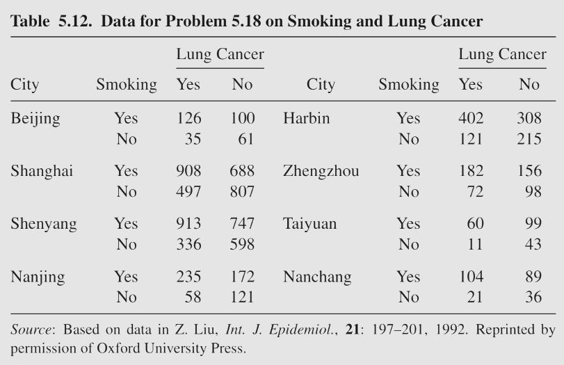
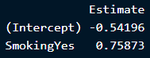
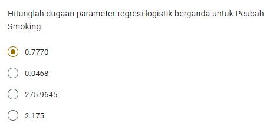
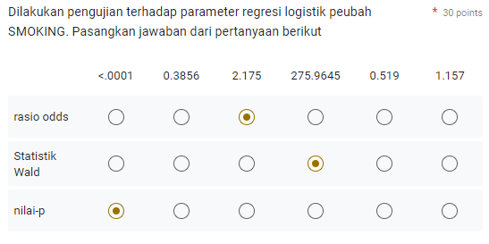
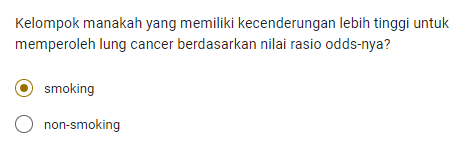
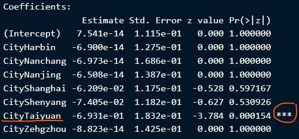
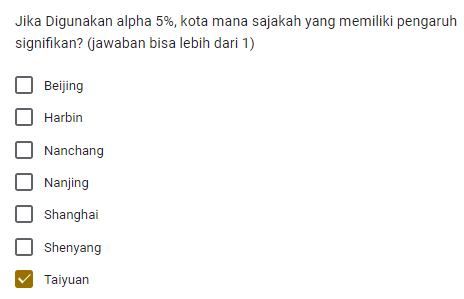
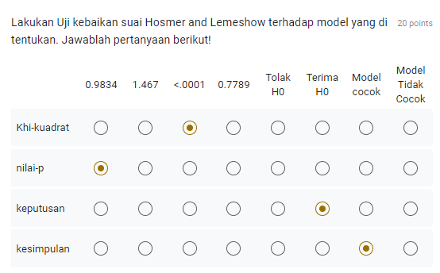
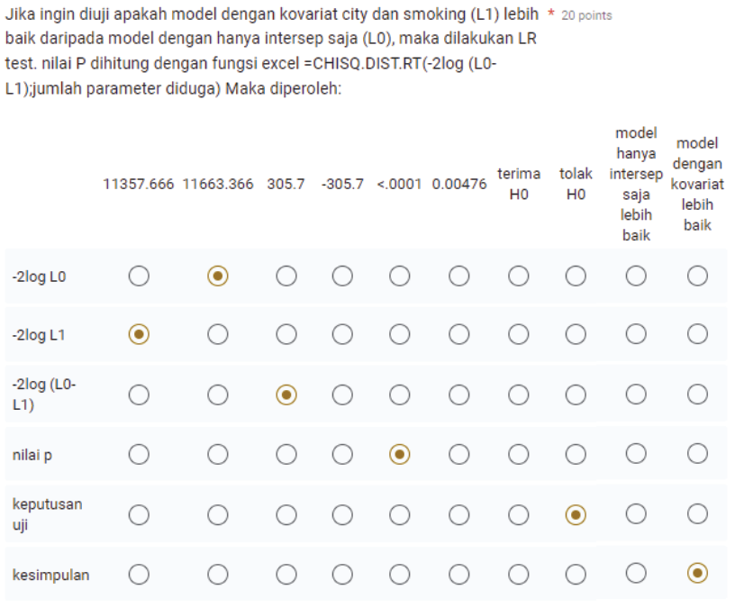

Kode di `Hide` dalam *default*, untuk menampilkan kode, klik `Code` .

```{r, warning=FALSE, message = FALSE}
#                      -=( Install & Load Package Function )=-
install_load <- function (package1, ...)  {   

   # convert arguments to vector
   packages <- c(package1, ...)

   # start loop to determine if each package is installed
   for(package in packages){

       # if package is installed locally, load
       if(package %in% rownames(installed.packages()))
          do.call('library', list(package))

       # if package is not installed locally, download, then load
       else {
          install.packages(package)
          do.call("library", list(package))
       }
   } 
}

#Path Function
path <- function(){
  gsub  ( "\\\\",  "/",  readClipboard ()  )
}
#Copy path, Panggil function di console
#Copy r path, paste ke var yang diinginkan
```

# Pendahuluan

## Kelompok 1

| **Nama**                  | **NIM**     |
|---------------------------|-------------|
| Karimatu Ain              | G1401211001 |
| Diva Nisfu Mustika        | G1401211002 |
| Lutfi Syahreza Lubis      | G1401211003 |
| Asfiah Adiba              | G1401211004 |
| Angga Fathan Rofiqy       | G1401211006 |
| Farhan Abdillah Harahap   | G1401211007 |
| Nabil Naufal              | G1401211008 |
| Muhammad Rizky Fajar      | G1401211009 |
| Mutiara Andhini           | G1401211010 |
| Muhammad Nafiz            | G1401211011 |
| Syifa Khairunnisa         | G1401211012 |
| Reynd Hamonangan Pasaribu | G1401211013 |

## Soal



## Data Entry

```{r message=FALSE, warning=FALSE}
install_load('dplyr', 'DT', 'tidyr', 'stringr')

# Mengubah Tabel Kontingensi ke dalam Data Frame R
data <- data.frame(
  City = rep(c("Beijing", "Shanghai", "Shenyang", "Nanjing", "Harbin", "Zehgzhou", "Taiyuan", "Nanchang"), each = 2),
  Smoking = rep(c("Yes", "No"), times = 8),
  LungCancer_Yes = c(126, 35, 908, 497, 913, 336, 235, 58, 402, 121, 182, 72, 60, 11, 104, 21),
  LungCancer_No = c(100, 61, 688, 807, 747, 598, 172, 121, 308, 215, 156, 98, 99, 43, 89, 36)
)
datatable(data)
```

## Transform Data

```{r}
data2 <- data %>%
  pivot_longer(cols = c("LungCancer_Yes", "LungCancer_No"), 
               names_to = "LungCancer", values_to = "Count") %>%
  mutate(LungCancer = ifelse(str_detect(LungCancer, "Yes"), "Yes", "No")) %>%
  uncount(weights = Count) %>%
  select(City, Smoking, LungCancer) %>%
  mutate(
    City = as.factor(City),
    Smoking = as.factor(Smoking),
    LungCancer = as.factor(LungCancer)
  )
datatable(data2)
```

## Data Checking

### Tipe Data

```{r}
str(data2)
```

Agar dapat bisa dianalisis, data harus bertipe `Factor`. Terlihat bahwa tipe data di atas sudah sesuai.

### Banyaknya data transform

```{r}
data_restored <- data2 %>%
  group_by(City, Smoking, LungCancer, .drop = TRUE) %>%
  summarize(Count = n(), .groups = 'drop') %>%
  pivot_wider(names_from = LungCancer, values_from = Count) %>%
  ungroup()
datatable(data_restored)
```

Bisa di cek bahwa. Jumlah data yang di transform sudah benar.

# Jawab Soal

## No 1.

> Hitunglah **dugaan parameter** regresi logistik berganda untuk **Peubah Smoking**

```{r}
model <- glm(LungCancer ~ Smoking, data = data2, family = binomial)
summary(model)
```

Bisa dilihat pada bagian {width="135"} bahwa nilai **dugaan parameter regresi logistik berganda untuk Peubah Smoking** adalah sekitar $0.75873$.

Sehingga jawaban yang tepat adalah :

{width="305"}

## No 2.

> **Nilai odds, p-value, dan Statistik Uji Wald** pada peubah Smoking

```{r}
summary_model <- summary(model)
rasio.odds <- exp(coef(model)) %>% round(.,3)
p.value <- summary(model)$coefficients[, "Pr(>|z|)"] %>% 
  sprintf("%.2e", .)

datatable(data.frame(rasio.odds, p.value))
```

Didapat bahwa nilai Rasio odds pada peubah Smoking diperoleh sebesar $2.136$.

```{r message=FALSE, warning=FALSE}
install_load('car')
Anova(model, type="II", test.statistic="Wald")
```

Lalu nilai **Statistik Uji Wald** nya sebesar $269.09$ dan *p-value* nya sangat kecil yakni kurang dari $2.2\times10^{-16}$.

Sehingga jawaban yang tepat adalah

{width="355"}

## **No 3.**

> **Rasio Odds** Lung Cancer

```{r}
rasio.odds
```

Bisa dilihat bahwa berdasarkan nilai rasio odds nya, kelompok yang memiliki kecenderungan lebih tinggi terkena kanker paru-paru adalah kelompok yang **merokok**. Yakni $2.136$ kali lebih besar dari pada yang tidak **merokok.**

Sehingga jawaban yang tepat adalah

{width="325"}

## **No 4.**

> **Kota** yang memilikipengaruh yang **signifikan**

```{r}
model2 <- glm(LungCancer ~ City, data = data2, family = binomial)
summary(model2)
```

Bisa dilihat pada bagian

{width="342"}

Bahwa **Kota yang memiliki pengaruh yang signifikan** adalah kota **Taiyuan.**

Sehingga jawaban yang tepat adalah

{width="289"}

## **No 5.**

> Lakukan **Uji kebaikan suai Hosmer** and **Lemeshow** terhadap model yang di tentukan. Tentukan *khi-kuadrat, p-value, keputusan, dan kesimpulan*.

**Hipotesis**

> $H_0$ : Model Cocok
>
> $H_1$ : Model Tidak cocok

```{r message=FALSE, warning=FALSE}
install_load("ResourceSelection")
hoslem.test(model$y, fitted(model))

predicted_probabilities <- predict(model, type = "response")
```

Didapatkan *Khi-kuadrat* sebesar $4.8903\times10^{-25}$. Nilainya sangat kecil, sehingga dapat dinyatakan **kurang dari** $0.001$. Didapat pula *p-value* yang besar yakni sebesar $1$. Karena *p-value* **lebih besar** dari taraf nyata $5\%$, maka **Tak Tolak** $H_0$. Artinya **Model** yang digunakan sudah **cocok.**

Sehingga jawaban yang tepat adalah

{width="347"}

## **No 6.**

> Jika ingin **diuji** apakah model dengan kovariat city dan smoking **(L1) lebih baik** daripada model dengan hanya intersep saja **(L0)**, maka dilakukan **LR test**.

**Hipotesis**

> $H_0$ : `City` dan `Smoking` tidak berpengaruh terhadap model
>
> $H_1$ : `City` dan `Smoking` berpengaruh terhadap model

**LR test**

```{r message=FALSE, warning=FALSE}
# Model hanya intersep (L0)
model.L0 <- glm(LungCancer ~ 1, data = data2, family = binomial)

# Model dengan City dan Smoking (L1)
model.L1 <- glm(LungCancer ~ City + Smoking, data = data2, family = binomial)

install_load("lmtest")
# Uji LR
lrtest(model.L0, model.L1)
```

Terlihat bahwa *p-value* bernilai $2.2\times10^{-16}$. Nilainya sangat kecil, sehingga dapat dinyatakan **kurang dari** $0.001$. Sehingga **Tolak** $H_0$, artinya `City` dan `Smoking` **berpengaruh** terhadap model.

**Nilai L0, L1, L0-L1**

```{r}
# -2log L0
minus2logL0 <- -2 * logLik(model.L0)

# -2log L1
minus2logL1 <- -2 * logLik(model.L1)

# -2log (L0-L1)
minus2logL0.L1 <- minus2logL0 - minus2logL1

log <- data.frame(minus2logL0, minus2logL1, minus2logL0.L1) %>% round(.,2)
colnames(log) <- c("-2log L0", "-2log L1", "-2log (L0-L1)")
datatable(log)
```

Diperoleh nilai $log{(\text{L}_0^{-2})}$ adalah sebesar $11663.37$. Lalu $log{(\text{L}_1^{-2})}$ bernilai $11357.67$. Dan $log{(\text{L}_0-\text{L}_1)^{-2}}$ sebesar $305.7$.

Sehingga jawaban yang tepat adalah

{width="381"}

# Hasil software lain

## SAS

```{r, tidy=FALSE, eval=FALSE, highlight=FALSE }
DATA tugas; 
INPUT city smoking lungcancer count;
DATALINES;
0 1 1 126
0 1 0 100
0 0 1 35
0 0 0 61
1 1 1 908
1 1 0 688
1 0 1 497
1 0 0 807
2 1 1 913
2 1 0 747
2 0 1 336
2 0 0 598
3 1 1 235
3 1 0 172
3 0 1 58
3 0 0 121
4 1 1 402
4 1 0 308
4 0 1 121
4 0 0 215
5 1 1 182
5 1 0 156
5 0 1 72
5 0 0 98
6 1 1 60
6 1 0 99
6 0 1 11
6 0 0 43
7 1 1 104
7 1 0 89
7 0 1 21
7 0 0 36
;
RUN;

PROC LOGISTIC DATA = tugas descending; weight count;
MODEL lungcancer = city smoking/rsquare lackfit;
RUN;
```
